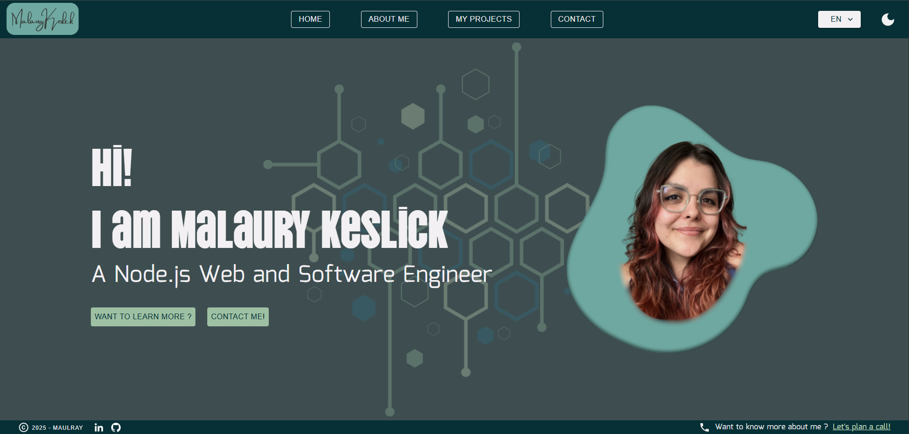

# 🌐 Personal web site and portfolio - Malaury Keslick

> Multilingual interactive portfolio created using Webpack, Javascript, React, MUI and deployed on Netlify.

---

## 🚀 Online access

🔗 [malaurykeslick.com](https://malaurykeslick.com)

---

## 📸 Overview



---

## 🛠️ Stack

- 🧩 [Node.js v.22](https://nodejs.org/) 
- ⚛️ [React](https://reactjs.org/) — UI framework
- 🌐 [React Router](https://reactrouter.com/) — application routing
- 🌍 [react-intl](https://formatjs.io/react-intl/) — internationalisation
- 🎨 [MUI](https://mui.com/) — component library, theming
- 📦 [Webpack](https://webpack.js.org/) — custom bundler
- 🌩️ [Netlify](https://www.netlify.com/) — continuous deployment

---

## 📁 Project structure

```
├── frontend/
│   ├── public/
│   ├──   ├── assets/       # Application assets (images and files to download)
│   ├──   ├── fonts/        # Application fonts
│   ├──   ├── index.html    # HTML template
│   ├── src/
│   ├──   ├── i18n/         # json files used for internationalisation
│   ├──   ├── theme/        # define light and dark mode colors + fonts
│   ├──   ├── views/        # jsx files and styles for the whole application
│   ├──   ├── index.js      # application entry point
│   ├── functions/          # netlify function : mail sending logic
│   ├── .env                # environment variables (see .env.example and rename for running locally)
│   ├── netlify.toml        # netlify run and deployment configuration file
│   ├── .babelrc            # babel configuration file
│   ├── webpack.config.js   # custom webpack configuration file
│   ├── package.json
├── backend/
│   ├── .env                # environment variables (see .env.example and rename for running locally)
│   ├── package.json
│   ├── index.js            # homemade express server for mail sending logic in local
└── package.json
└── .gitignore
└── README.md
└── assets                  # ReadMe assets
```

---

## ⚙️ Installation

```bash
# 1. Clone repo
git clone https://github.com/Maulraay/portfolio.git

# 2. Navigate into the created folder
cd portfolio

# 3. Navigate to backend/ and frontend/ and rename .env.example to .env
# Update .env variables with your mailing application credentials

# 3. Install dependencies
npm install

# 4. Run dev server. It will use my homemade Express server for the mail sending feature. 
# If you want to use Netlify functions, first setup a Netlify project.
npm run dev
```

---

## 🧪 Available scripts

| Commande        | Description                                                                    |
|-----------------|--------------------------------------------------------------------------------|
| `npm run dev`   | Launch frontend/ on port 9500 and backend/ on port 5000                        |
| `npm run build` | Compile app frontend in `frontend/dist`                                        |
| `netlify serve` | **If configured**<br/>Build the app with Netlify config (online env variables) |

---

## 🌍 Environment

👉 See `.env.example` for the environment variables setup. Rename this file to .env when updated with your credentials.


---

## 🛠 Deployment (Netlify)

- See the [Netlify documentation](https://docs.netlify.com/start/overview/) to learn how to deploy a website with Netlify
- Automatic deployment via `git push` to the main branch.
- Environment variables managed through the Netlify dashboard.
- Static files in `public/`, final build output in `dist/`.

---

## 🚧 Contributing & Feedback

This project is a continuous work in progress — improvements are always welcome!

If you find any bugs 🐞 or have suggestions 💡, feel free to [open an issue](https://github.com/Maulraay/portfolio/issues).  
Your feedback helps make the project better. Thanks!

---

## 🙋‍♀️ Author

**Malaury Keslick**
📫 [LinkedIn](https://www.linkedin.com/in/malaurykeslick/) · ✉️ [mkeslick.pro@gmail.com](mailto:mkeslick.pro@gmail.com)
